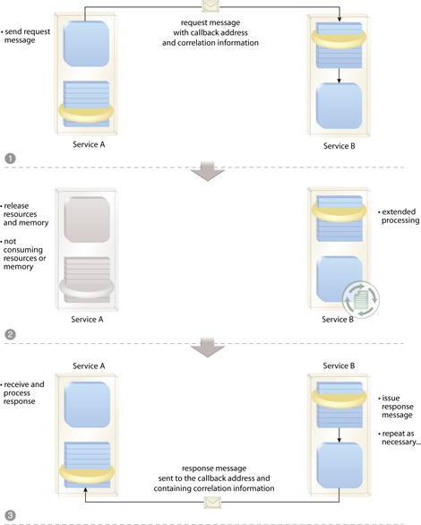

# Asyncapi::Client

Asyncapi::Client is a Rails engine that easily allows asynchronous communication with a [Asyncapi::Server](https://github.com/G5/asyncapi-server)-based API server.

The common pattern that this gem saves you from implementing for the service callback pattern. [soapatterns.org](http://soapatterns.org/design_patterns/service_callback) describes it well, and [this image they provide](http://soapatterns.org/static/images/figures/service_callback/fig1.png) summarizes it:



Implementing this typically requires a bunch of code that looks the same: HTTP posts, receive hooks - all while the data that's passed around different.

# Usage

To communicate with the server (in the spirit of running things in the background, call the following from a worker):

```ruby
Asyncapi::Client::Job.post(
  "http://server.com/long/running/process",
  # Options below are optional
  body: {info: "i want to send"},
  headers: { AUTHORIZATION: "Bearer XYZ" },
  on_success: DoOnSuccess,
  on_error: DoOnError,
  on_queue: DoOnQueue,
  on_queue_error: DoOnQueueError,
  on_time_out: DoOnTimeOut,
  time_out: 2.minutes # Defaults to nil (never time out)
)
```

Here is a breakdown of what these parameters mean:

- `http://server.com/long/running/process`: this is an endpoint that you will create using [Asyncapi::Server](https://github.com/G5/asyncapi-server)
- `body`: any data you want to send to the server that's needed for it to do its work
- `headers`: if needed, headers for authorization, for example
- `on_success`, `on_error`, `on_*`: service objects that will get executed whenever these events occur. More on this below.
- `time_out`: when this job should be considered timed out. This is helpful when you want to know if the server ever got to working on the job. Jobs that should be timed out are marked as `timed_out` approximately every minute.

## `on_*` Callbacks

```ruby
class DoOnQueue < Asyncapi::Client::CallbackRunner
  def call
    Rails.logger.info "Job##{job.id} successfully queued with body: #{job.body}"
  end
end

class DoOnSuccess < Asyncapi::Client::CallbackRunner
  def call
    Rails.logger.info "Job##{job.id} is done. The server's response: #{job.message}"
  end
end

class DoOnError < Asyncapi::Client::CallbackRunner
  def call
    Rails.logger.info "Job##{job.id} failed. The server's response: #{job.message}"
  end
end
```

In the callback service objects, you have access to the `job` and its fields (directly):

- `callback_params`
- `body`
- `headers`
- `message`
- `response_code`

Currently, this Engine only works with [Sidekiq](http://sidekiq.org), [typhoeus](https://github.com/typhoeus/typhoeus), and [kaminari](https://github.com/amatsuda/kaminari). Customizing these can be introduced to this gem as needed.

To run the application, you need to have the Sidekiq workers running as well.

There is a feed of all jobs that can be accessed via `/asyncapi/client/v1/jobs.json`. You can pass `per_page` and `page` to paginate through the records. Pagination is done by [api-pagination](https://github.com/davidcelis/api-pagination) via kaminari.

## Expiry

To make space in the database, old jobs must be deleted. By default, jobs older than 10 days will be deleted in both the Asyncapi Client and Asyncapi Server. Asyncapi Client is responsible for deleting the jobs it no longer needs a response from on the server.

By default, jobs 10 days old and older will be deleted. You can change this setting by putting this in an initializer:

```ruby
Asyncapi::Client.expiry_threshold = 5.days
```

If you don't want the jobs to get deleted, set the threshold to `nil`.

The cleaner job is run every day at "0 0 * * *". If you want to change the frequency that this runs, then:

```ruby
Asyncapi::Client.clean_job_cron = "30 2 * * *"
```

# Installation

**Note**: if you're using the `protected_attributes`, also see the "Optional" section below.

## Required

Add the gem to the Gemfile:

```
gem "asyncapi-client"
```

From your Rails app:

```
rails g asyncapi:client:config
rake asyncapi_client:install:migrations
rake db:migrate
```

Make sure you have `:host` in the `default_url_options` set up for your server. Example `config/initializers/default_url_options.rb`:

```ruby
Rails.application.routes.default_url_options ||= {}
Rails.application.routes.default_url_options[:host] = ENV["HOST"]
```

## Optional:

If you want to change the controller that the engine's controllers inherit from, from an initializer:

```
Asyncapi::Client.configure do |c|
  c.parent_controller = Api::BaseController
end
```

If you use `protected_attributes`, you need to whitelist attributes. In an initializer:

```ruby
Asyncapi::Client::Job.attr_accessible(
  :follow_up_at,
  :time_out_at,
  :on_queue,
  :on_success,
  :on_error,
  :on_queue_error,
  :headers,
  :body,
  :status,
  :response_code,
)
```

If you use FactoryGirl, you can require the factories for easy testing and stubbing:

```ruby
require "asyncapi/client/factories"
```

# Security

`asyncapi-client` generates a secret for the job using `SecureRandom.uuid`, and sends this to the app using `asyncapi-server`. The server app, using the latest compatible gem, will reply with the secret in the params. `asyncapi-client` will make sure the job id matches with the given secret.

# Development

```
rake app:db:schema:load
rspec spec
```

# License

Copyright (c) 2016 G5

MIT License

Permission is hereby granted, free of charge, to any person obtaining a copy of this software and associated documentation files (the "Software"), to deal in the Software without restriction, including without limitation the rights to use, copy, modify, merge, publish, distribute, sublicense, and/or sell copies of the Software, and to permit persons to whom the Software is furnished to do so, subject to the following conditions:

The above copyright notice and this permission notice shall be included in all copies or substantial portions of the Software.

THE SOFTWARE IS PROVIDED "AS IS", WITHOUT WARRANTY OF ANY KIND, EXPRESS OR IMPLIED, INCLUDING BUT NOT LIMITED TO THE WARRANTIES OF MERCHANTABILITY, FITNESS FOR A PARTICULAR PURPOSE AND NONINFRINGEMENT. IN NO EVENT SHALL THE AUTHORS OR COPYRIGHT HOLDERS BE LIABLE FOR ANY CLAIM, DAMAGES OR OTHER LIABILITY, WHETHER IN AN ACTION OF CONTRACT, TORT OR OTHERWISE, ARISING FROM, OUT OF OR IN CONNECTION WITH THE SOFTWARE OR THE USE OR OTHER DEALINGS IN THE SOFTWARE.
